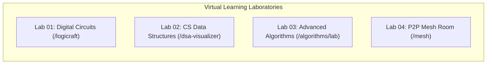

# ⚡ signalschool — Virtual Learning Labs

> **Make the invisible visible**: Real-time Digital Circuit Schematics, Interactive Data Structures, Advanced Algorithms, and Zero-Backend P2P Collaboration for Higher Education.

[](https://dsd6.vercel.app/)
[](https://github.com/Abhishaik3007/dsd_6.git)
[](https://react.dev/)
[](https://vite.dev/)
[](https://tailwindcss.com/)
[](https://peerjs.com/)
[](https://firebase.google.com/)

---

## 🌟 Instant Browser Demo

No installation required! Experience the complete, live platform deployed on the edge:

👉 **[Launch signalschool Web Application (https://dsd6.vercel.app/)](https://dsd6.vercel.app/)** 👈

---

## 📖 Complete Documentation Suite

Comprehensive technical documentation adhering to the **Divio Documentation Framework** is available in the [`docs/`](docs/INDEX.md) folder:

| Documentation Section | Link | Key Highlights |
| :--- | :--- | :--- |
| **Documentation Index** | [`docs/INDEX.md`](docs/INDEX.md) | Central documentation hub and navigation map |
| **System Architecture** | [`docs/ARCHITECTURE.md`](docs/ARCHITECTURE.md) | State machines, context hierarchy, routing, Firestore schema, WebRTC topology |
| **Auth & Security** | [`docs/AUTHENTICATION_AND_SECURITY.md`](docs/AUTHENTICATION_AND_SECURITY.md) | Multi-tenant RBAC, HMAC-SHA256 OTP verification, and password recovery |
| **Lab 01: Digital Circuits** | [`docs/LAB_01_LOGIC_SIMULATOR.md`](docs/LAB_01_LOGIC_SIMULATOR.md) | Boolean solver, feedback loops, IC silicon specs, and truth table notebook |
| **Lab 02: CS Data Structures** | [`docs/LAB_02_DATA_STRUCTURES.md`](docs/LAB_02_DATA_STRUCTURES.md) | Animated memory layouts for BST, AVL rotations, B-Trees, Heaps, and Graphs |
| **Lab 03: Advanced Algorithms**| [`docs/LAB_03_ALGORITHM_VISUALIZER.md`](docs/LAB_03_ALGORITHM_VISUALIZER.md) | DP & Backtracking (N-Queens, Knapsack), Pathfinding, and Web Audio pitch feedback |
| **Lab 04: P2P Mesh Room** | [`docs/LAB_04_P2P_MESH_ROOM.md`](docs/LAB_04_P2P_MESH_ROOM.md) | Zero-server WebRTC chat, 16KB chunked file transfers, and synthesized sound FX |
| **Enterprise & Tiers** | [`docs/ENTERPRISE_AND_TIERS.md`](docs/ENTERPRISE_AND_TIERS.md) | Super Admin (`/schule`), Campus Admin (`/admin`), Quota gauges, and QR passes |
| **API Reference** | [`docs/API_REFERENCE.md`](docs/API_REFERENCE.md) | Serverless endpoints (`/api/send-otp`, `/api/verify-otp`), client services |
| **Deployment & Config** | [`docs/DEPLOYMENT_AND_CONFIGURATION.md`](docs/DEPLOYMENT_AND_CONFIGURATION.md) | Environment setup, Firebase provisioning, Resend email, and Vercel edge build |
| **Contributing** | [`docs/CONTRIBUTING.md`](docs/CONTRIBUTING.md) | Engineering standards, React 19 rules, Oxlint linter, and PR workflows |

---

## 💡 Why signalschool Exists

In modern engineering education, the most foundational concepts—how electrons flip logic bits, how memory addresses rewire pointers, how backtracking prunes recursion trees, and how packets traverse peer meshes—are trapped in abstract mathematical equations or static 2D textbook pages.

**signalschool** turns these invisible mechanisms into tactile, interactive simulations:
1. **Interactive Logic Workbench**: Wire up switches, gates, clocks, and flip-flops with smooth Bézier curves, verifying propagation delays and truth tables in real time.
2. **Visual Memory Execution**: Watch pointers rewire, AVL trees balance with fluid rotations, and hash collisions resolve step-by-step.
3. **Multi-Sensory Algorithm Training**: Visualize dynamic programming matrices and listen to real-time audio pitch frequencies mapped directly to sorting bar comparisons.
4. **Campus Enterprise Administration**: Provide university deans and department chairs with seat quotas, roster management, instant QR passes, and automated onboarding.
5. **Decentralized Collaboration**: Chat and exchange schematic files in an encrypted WebRTC room without intermediate server databases storing conversations.

---

## 🚀 Quickstart: Run Locally in Under 2 Minutes

### 1. Prerequisites
- **Node.js**: v18.0.0 or higher
- **npm**: v9.0.0 or higher

### 2. Setup Commands
```bash
# Clone the repository
git clone https://github.com/Abhishaik3007/dsd_6.git
cd dsd_6

# Install dependencies
npm install

# Copy environment template
cp .env.example .env.local

# Start Vite development server
npm run dev
```

Open `http://localhost:5173/` in your browser.

---

## 🔬 Four Core Virtual Laboratories



### 1. Lab 01: Digital Circuits & Logic Simulator (`/logicraft`, `/circuits`)
- **Components**: SPST switches, LED indicator bulbs with neon glow shaders, Clock pulse generator, NOT, AND, NAND, OR, NOR, XOR, XNOR, D Flip-Flop, T Flip-Flop, and JK Flip-Flop.
- **Cycle-Aware Solver**: Fixed-point iterative solver (`simulator.js`) capable of simulating feedback latches, registers, and sequential counters.
- **Truth Table Notebook**: Automated $2^N$ combinational testing, JSON schematic export/import, and undo/redo history.
- **IC Reference**: Cross-referenced with standard 74xx TTL/CMOS chips (74LS00, 74LS04, 74LS08, 74LS74, etc.) with propagation delay specifications.

### 2. Lab 02: CS Data Structures Visualizer (`/dsa`, `/dsa-visualizer`)
- **10+ Structural Visualizers**: Arrays, Singly/Doubly Linked Lists, Stacks, Queues, Binary Search Trees, Self-Balancing AVL Trees (LL, RR, LR, RL rotations), B-Trees, Hash Tables (Separate Chaining & Linear Probing), Binary Heaps, Graphs (BFS/DFS), and Tries.
- **Pedagogy**: Memory cell pointer tracking, Big-O complexity tables, and multi-language reference implementations in **C++**, **Java**, **Python**, and **JavaScript**.

### 3. Lab 03: Advanced Algorithms & DP Lab (`/algorithms`, `/algorithms/lab`)
- **Dynamic Programming & Backtracking**: N-Queens, 0/1 Knapsack 2D table, Longest Common Subsequence (LCS), Sudoku Solver, and Coin Change.
- **Pathfinding & Grid Mazes**: Dijkstra’s Algorithm, A* Heuristic Search, Breadth-First Search, Depth-First Search, and Recursive Division maze generation.
- **Search & Pointers**: Binary search bounds, Two Pointers (Two Sum, Trapping Rain Water), and Sliding Window dynamics.
- **Acoustic Sorting**: Synthesizes real-time audio frequencies via the Web Audio API mapped to bar element comparisons.

### 4. Lab 04: Decentralized P2P Mesh Room (`/mesh`, `/chat`)
- **Zero-Server WebRTC**: Powered by PeerJS data channels. Zero database storage or packet logging.
- **Chunked File Pipeline**: 16KB data channel streaming for images, diagrams, and circuit JSON schematics.
- **Procedural Audio**: Web Audio API sound synthesizer for user joins, departures, and message alerts.

---

## 🏢 Enterprise Multi-Tenancy & Campus Governance

- **Central Super Admin (`/schule`, `/super-admin`)**: Platform-wide metrics, university contract provisioning, ARR calculations, and dynamic tier governance (`/tiers`).
- **Institute Admin Portal (`/admin`)**: Department dean dashboard, seat capacity gauge, CSV bulk roster import, and dynamic Join Codes (`/join?code=STAN-92`).
- **Campus QR Pass (`CampusQrPassModal.jsx`)**: Real-time vector QR code for projection in lecture halls and computer labs.
- **Cryptographic OTP Verification**: Stateless HMAC-SHA256 signed verification codes preventing timing attacks (`crypto.timingSafeEqual`).

---

## 📁 Repository Structure

```text
dsd_6/
├── api/                          # Vercel Edge Serverless Functions
│   ├── firebase-admin.js         # Firebase Admin SDK initialization
│   ├── request-password-reset.js # Branded password recovery dispatcher
│   ├── send-otp.js               # HMAC-SHA256 OTP generation & email dispatch
│   └── verify-otp.js             # Constant-time OTP signature verifier
├── docs/                         # Divio Technical Documentation Suite
│   ├── INDEX.md                  # Master documentation directory
│   ├── ARCHITECTURE.md           # System architecture & data flow
│   ├── AUTHENTICATION_AND_SECURITY.md # Multi-tenant RBAC & OTP security
│   ├── LAB_01_LOGIC_SIMULATOR.md # Digital electronics & schematic engine
│   ├── LAB_02_DATA_STRUCTURES.md # CS visualizer & memory pointer models
│   ├── LAB_03_ALGORITHM_VISUALIZER.md # Advanced algorithms & DP lab
│   ├── LAB_04_P2P_MESH_ROOM.md   # WebRTC peer-to-peer data channels
│   ├── ENTERPRISE_AND_TIERS.md   # Campus licensing & tier governance
│   ├── API_REFERENCE.md          # Serverless and client API reference
│   ├── DEPLOYMENT_AND_CONFIGURATION.md # Firebase, Resend & Vercel guide
│   └── CONTRIBUTING.md           # Coding standards & pull request guide
├── public/                       # Static public assets & favicons
├── src/
│   ├── components/
│   │   ├── admin/                # SuperAdmin, InstituteAdmin & QR Pass
│   │   ├── algo-visualizer/      # Lab 03: DP, Pathfinding, Pointers & Sound
│   │   ├── auth/                 # Multi-role login, OTP verify, password reset
│   │   ├── chat/                 # Lab 04: P2P Mesh Room & audio synthesizer
│   │   ├── common/               # Shared bars, menus, access gates
│   │   ├── cs-visualizer/        # Lab 02: Data structures visualizer engines
│   │   ├── digital-electronics/  # Lab 01: Silicon catalog & study docs
│   │   ├── dsa/                  # Lab 02: DSA theory & code examples
│   │   ├── landing/              # 3D Three.js landing page & manifesto
│   │   ├── logic-gates/          # Lab 01: Interactive circuit workbench
│   │   └── pricing/              # Transparent campus & individual pricing
│   ├── context/
│   │   ├── AuthContext.jsx       # Firebase Auth, RBAC & user state
│   │   ├── HubContext.jsx        # Client-side tab router & history sync
│   │   └── InstituteContext.jsx  # Campus seats, rosters & Firestore sync
│   ├── lib/
│   │   └── firebase.js           # Client Firebase initialization
│   ├── services/
│   │   ├── cryptoUtils.js        # SHA-256 and token generators
│   │   └── emailVerificationService.js # Multi-provider email dispatch adapter
│   ├── utils/
│   │   ├── authErrorUtils.js     # User-friendly auth error mapping
│   │   ├── firestoreSecurityScrubber.js # Plaintext password purge utility
│   │   ├── layout.js             # Automated schematic canvas layout
│   │   ├── simulator.js          # Boolean circuit solver & propagation engine
│   │   ├── subscriptionUtils.js  # License validation & seat expiration checks
│   │   └── tierConfig.js         # Contract tier quotas & pricing constants
│   ├── App.jsx                   # Main application router & route guards
│   ├── index.css                 # Tailwind CSS v4 design system
│   └── main.jsx                  # React 19 entry point
├── package.json
├── vercel.json                   # Edge routing rewrite rules
├── vite.config.js                # Vite build config with React & Tailwind plugins
└── README.md                     # Master project overview (You are here)
```

---

## 📜 Available NPM Scripts

| Command | Action |
| :--- | :--- |
| `npm run dev` | Starts Vite development server at `http://localhost:5173/` |
| `npm run build` | Compiles production-optimized bundle to `dist/` |
| `npm run preview` | Locally serves production build for verification |
| `npm run lint` | Runs ultra-fast Rust-based static code analysis with Oxlint |

---

## ⌨️ Keyboard Shortcuts

| Key Binding | Action | Context |
| :--- | :--- | :--- |
| `Ctrl + Z` / `Cmd + Z` | Undo last circuit edit | Lab 01 (Logic Gates) |
| `Ctrl + Y` / `Cmd + Shift + Z` | Redo undone circuit edit | Lab 01 (Logic Gates) |
| `Delete` / `Backspace` | Remove selected gate or wire | Lab 01 (Logic Gates) |
| `Space` | Play / Pause algorithm animation | Lab 02 & Lab 03 |
| `Esc` | Close open modal, preset, or drawer | Global |

---

## 📄 License & Attribution

This project is open-source and created for educational purposes.  
**Live Application**: [https://dsd6.vercel.app/](https://dsd6.vercel.app/)  
**Source Repository**: [https://github.com/Abhishaik3007/dsd_6.git](https://github.com/Abhishaik3007/dsd_6.git)
